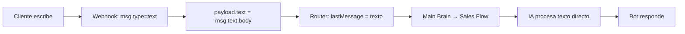
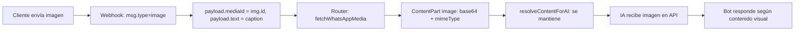
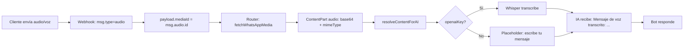
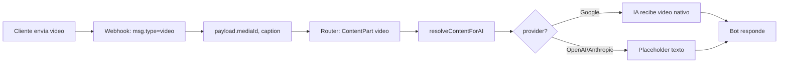

# Flujo de mensajes multimodales (texto, audio, imágenes)

Este documento describe el flujo explícito de interpretación de mensajes entrantes del cliente por WhatsApp: texto, audios (incl. notas de voz) e imágenes.

---

## Diagrama general: de WhatsApp al bot

```
┌──────────────────┐     POST /api/webhook/whatsapp      ┌─────────────────────────┐
│  Cliente WhatsApp │ ─────────────────────────────────► │  Webhook WhatsApp       │
│  (escribe/audio/  │   { type, text?, image?, audio?,   │  route.ts               │
│   imagen)         │     video?, document?, sticker? }   │                         │
└──────────────────┘                                     └───────────┬─────────────┘
                                                                      │
                                                                      ▼
┌──────────────────┐     payload { phone, text?, type,   ┌─────────────────────────┐
│  Router           │     mediaId?, messageId }            │  router.ts               │
│  routeIncoming... │ ◄──────────────────────────────────│  • Obtiene/crea contacto │
└────────┬─────────┘                                     │  • Obtiene/crea conv.   │
         │                                               └───────────┬─────────────┘
         │  Si mediaId: fetchWhatsAppMedia() ──► base64               │
         │                                                             │
         ▼                                                             ▼
┌──────────────────────────────────────────────────────────────────────────────┐
│  Construcción de lastMessage (ContentPart[])                                  │
│  • texto     → string / [{ type:"text", text }]                               │
│  • imagen    → [{ type:"image", base64, mimeType }] (+ caption si hay)         │
│  • audio     → [{ type:"audio", base64, mimeType }]                            │
│  • video     → [{ type:"video", base64, mimeType }] (+ caption si hay)         │
│  • document  → [{ type:"text", text:"[Documento recibido...]" }]               │
│  • sticker   → [{ type:"image", base64, mimeType }] (como imagen)              │
└──────────────────────────────────────────────────────────────────────────────┘
         │
         ▼
┌──────────────────┐     lastMessage + history    ┌─────────────────────────────┐
│  Main Brain      │ ───────────────────────────► │  processSalesFlow()         │
│  main-brain.ts   │                              │  sales-flow-brain.ts        │
└──────────────────┘                             └───────────┬─────────────────┘
                                                              │
                                                              ▼
┌──────────────────────────────────────────────────────────────────────────────────┐
│  resolveContentForAI (ai-multimodal.ts) – interpretación para IA                  │
│  • texto   → se mantiene                                                         │
│  • imagen  → se mantiene (la IA verá la imagen en base64)                         │
│  • audio   → transcribe con Whisper → "[Mensaje de voz transcrito]: ..."          │
│  • video   → Google: nativo | OpenAI/Anthropic: sustituido por texto genérico    │
└──────────────────────────────────────────────────────────────────────────────────┘
         │
         ▼
┌──────────────────┐     callAIMultimodal()       ┌─────────────────────────────┐
│  Respuesta bot   │ ◄────────────────────────────│  OpenAI / Anthropic / Google│
│  sendWhatsApp... │     { reply, sendImages?,    │  (usa imagen si hay,         │
└──────────────────┘     handoffRequired? }      │   texto transcrito si audio)│
                                                  └─────────────────────────────┘
```

---

## Flujo por tipo de mensaje

### 1. TEXTO



**Validación:** ✅  
- Webhook: `msgType === "text"` → `payload.text = msg.text.body`  
- Router: `lastMessageContent = msg.text?.trim()`  
- IA recibe el texto tal cual.

---

### 2. IMAGEN



**Flujo explícito de imágenes:**

1. **Webhook** (`route.ts`): Detecta `msg.type === "image"`, extrae `msg.image.id` y `msg.image.caption`.
2. **Router**: Descarga el binario vía Graph API → convierte a base64.
3. **ContentPart**: `{ type: "image", base64, mimeType }`. Si hay caption, se combina: `[{ text }, { image }]`.
4. **IA**:  
   - OpenAI: `image_url` con `data:image/...;base64,...`  
   - Anthropic: `source.type: "base64"`  
   - Google: `inlineData` con base64

**Validación:** ✅  
- Imagen con caption → la IA recibe texto + imagen.  
- Imagen sin caption → se añade hint: `[El cliente ha enviado: image. Analízalo...]` + la imagen.

---

### 3. AUDIO (incl. notas de voz)



**Flujo explícito de audios:**

1. **Webhook**: `msg.type === "audio"` → `payload.mediaId = msg.audio.id`, `payload.text = ""`.
2. **Router**: Descarga audio, crea `{ type: "audio", base64, mimeType }`.
3. **resolveContentForAI**:  
   - Con `OPENAI_API_KEY` (o key del bot): transcribe con Whisper → reemplaza por texto.  
   - Sin key: mensaje genérico pidiendo que escriba.

**Validación:** ✅  
- Formato típico de WhatsApp: ogg-opus. Whisper acepta ogg, webm, mp3, etc.

**Requisito:** `BOT_OPENAI_API_KEY` configurado para transcripción de audio.

---

### 4. VIDEO



**Validación:**  
- Google: soporte nativo de video.  
- OpenAI/Anthropic: se sustituye por texto genérico (limitación de la API).

---

### 5. DOCUMENTO y STICKER

| Tipo       | Webhook         | Interpretación para IA                              |
|-----------|-----------------|-----------------------------------------------------|
| document  | mediaId + caption | `[Documento recibido. Descríbeme por escrito...]` |
| sticker   | mediaId         | Tratado como imagen (ContentPart `image`)         |

---

## Almacenamiento en BD

| Campo   | Texto               | Imagen           | Audio            |
|---------|----------------------|------------------|------------------|
| content | texto literal        | `"caption [image]"` o `"[image]"` | `"[audio]"` o con caption |
| type    | `text`               | `image`          | `audio`          |
| mediaUrl| null                 | null*            | null*            |

\* La URL del medio no se persiste; el binario se descarga en el momento y se pasa a la IA.

---

## Tabla de validación

| Tipo enviado por cliente | ¿Se interpreta? | ¿IA recibe contenido real?      | Notas                    |
|--------------------------|-----------------|----------------------------------|--------------------------|
| Texto                    | ✅ Sí           | ✅ Sí                            | Directo                  |
| Imagen                   | ✅ Sí           | ✅ Sí (base64)                   | Con o sin caption        |
| Audio / nota de voz      | ✅ Sí           | ✅ Sí (transcrito con Whisper)   | Requiere `BOT_OPENAI_API_KEY` |
| Video                    | ✅ Sí           | ⚠️ Google sí; otros: placeholder | Limitación API           |
| Documento                | ✅ Sí           | ⚠️ Placeholder texto            | Se pide descripción      |
| Sticker                  | ✅ Sí           | ✅ Sí (como imagen)              | Mapeado a `image`        |

---

## Tipos adicionales soportados

| Tipo        | Interpretación                                                    |
|-------------|-------------------------------------------------------------------|
| voice       | Tratado como audio (transcripción con Whisper)                   |
| location    | `payload.text` = dirección o `[Ubicación: lat, lng]`              |
| interactive | Texto del botón o ítem de lista seleccionado                      |

## Tipos de WhatsApp no soportados

Si el webhook recibe tipos como `contacts`, `reaction`, etc., el mensaje se omite (`continue`). No se guarda ni se responde.

---

## Flujo de imágenes de productos (respuesta del bot)

Cuando el cliente pide fotos/productos/barriles:

1. **Sales Flow** detecta palabras clave → `sendImages = true`.
2. **Main Brain** llama a `sendProductImages(contactPhone)`.
3. Se obtiene el catálogo desde `AppConfig` (JSON de URLs de productos).
4. Por cada producto: `sendWhatsAppImage(phone, url, description)`.

```
Cliente: "Muéstrame fotos de barriles"
    → IA responde + sendImages=true
    → sendProductImages() envía cada imagen del catálogo por WhatsApp
```

Este flujo está separado del flujo de mensajes entrantes; aquí el bot envía imágenes, no las interpreta.
